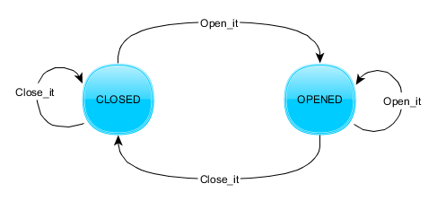
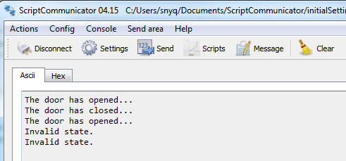

# fsm
A fsm(finite state machine) library, in order to simplify the work of handling state machine.

It's recommended to use FSM instead of if/else or switch code at the scenario with complicated logics.

## Feature

- Pure C code
- Clear architecture
- Multiple FSM instances support

## Usage

1. Define your STATE, STATE_CALLLBACK_FUNCTION, EVENT and STATE_TRANSITION_FUNCTION.
2. Create a fsm instance by `fsm_create()`.
3. Add states, events and transition functions into fsm.
4. Call `fsm_run()` at appropriate place.

## Example

Take open and close the door as an example.

The state diagram is shown like below:



There are two states: CLOSED and OPENED.

Two events: Open_it and Close_it.

Two transition function: from CLOSED to OPENED and from OPENED to CLOSED.

In the code, we set state:

```C
typedef enum {
    DOOR_STATE_OPENED,
    DOOR_STATE_CLOSED,
} door_state_t;
```

In the state callback function part, we print out current state name and do nothing else, like this:

```C
void door_opened(void)
{
    i("The door has opened...\r\n");
}

void door_closed(void)
{
    i("The door has closed...\r\n");
}
```

Now we can get two state variables:

```C
fsm_state_t state_opened   = {DOOR_STATE_OPENED,  door_opened};
fsm_state_t state_closed   = {DOOR_STATE_CLOSED,  door_closed};
```

In regard to two events, we set like this:

```C
typedef enum {
    DOOR_EVENT_OPEN,
    DOOR_EVENT_CLOSE, 
} door_event_t;
```

Then transition functions are set like this:

```C
fsm_transition_t door_state_transition_list[] = {
    {state_closed, DOOR_EVENT_OPEN,  state_opened},
    {state_opened, DOOR_EVENT_CLOSE, state_closed},
};
```
Look into these transition funcitons, they are consisted of `current state`, `event`, and `next state`.

OK, add those stuff into a FSM variable:

```c
fsm_addState(fsm, state_opened);
fsm_addState(fsm, state_closed);

fsm_addEvent(fsm, (fsm_event_t)DOOR_EVENT_OPEN);
fsm_addEvent(fsm, (fsm_event_t)DOOR_EVENT_CLOSE);

for (i = 0; i < door_state_transition_list_count; i++) {
	fsm_addTransition(fsm, door_state_transition_list[i]);    
}
```
Of course we have to create a FSM variable at the beginning by:

```C
fsm_t* fsm = fsm_create(state_closed);	
```

Where the parameter is the initializing state.

OK, we can handle state changes like:

```C
fsm_run(fsm, DOOR_EVENT_OPEN);
fsm_run(fsm, DOOR_EVENT_CLOSE);
```

Our test code is:

```C
fsm_run(fsm, DOOR_EVENT_OPEN);
fsm_run(fsm, DOOR_EVENT_CLOSE);
fsm_run(fsm, DOOR_EVENT_OPEN);
fsm_run(fsm, DOOR_EVENT_OPEN);
fsm_run(fsm, DOOR_EVENT_OPEN);
```

The result is:



## Note

The Heap Size of this project need to set larger than 0x400, as it uses logger library which consumes 0x200 heap memory.
